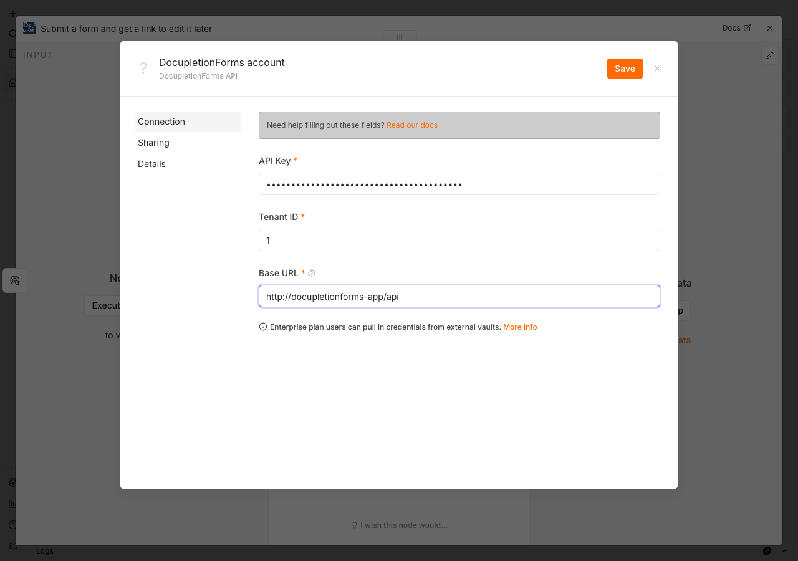
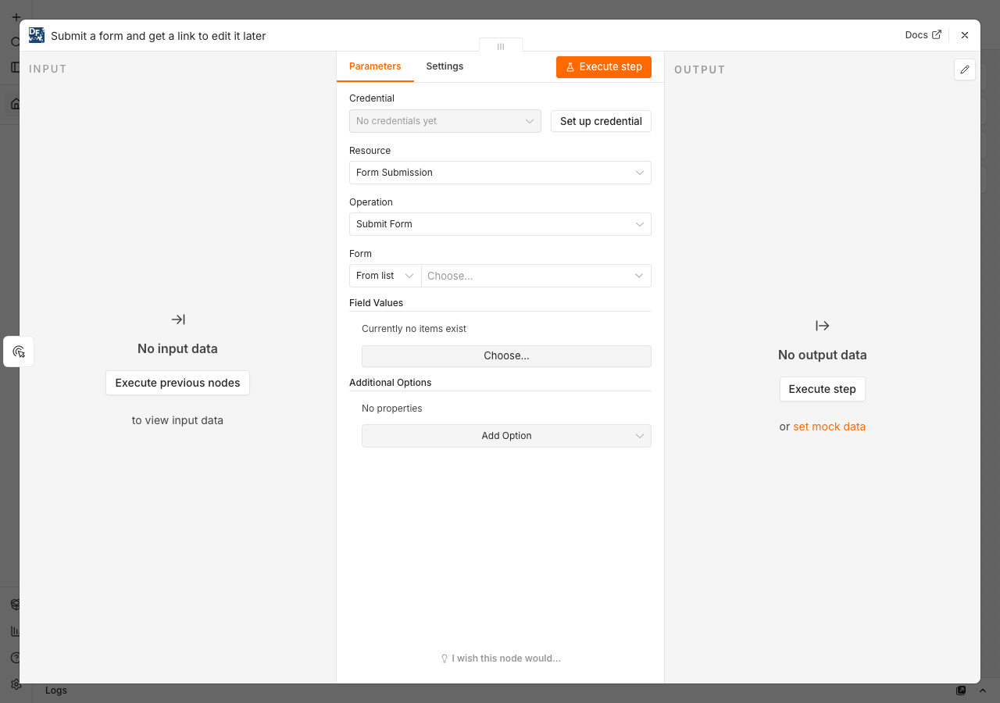
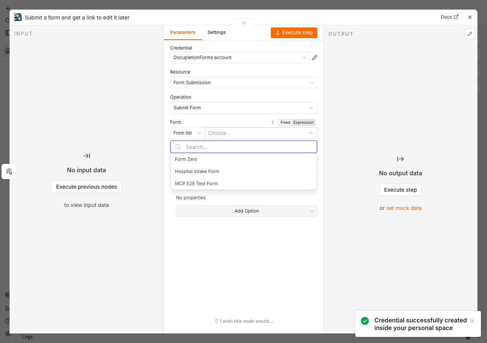
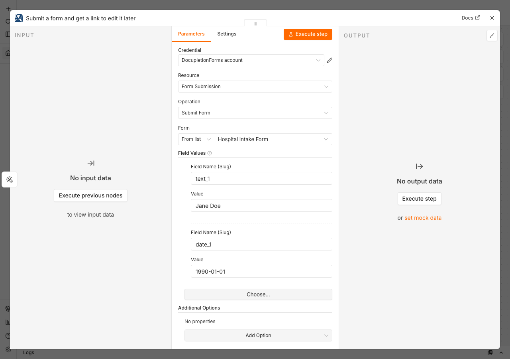
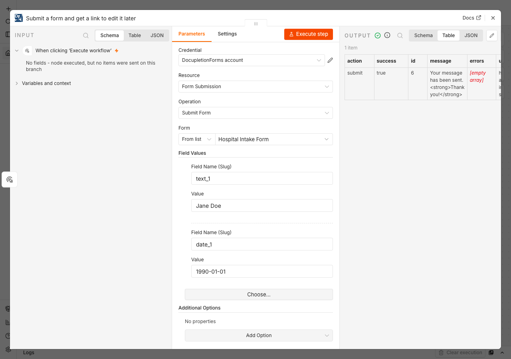

# n8n-nodes-docupletionforms

This repo contains [DocupletionForms](https://docupletionforms.com)' community node for n8n — conditional logic forms with automated PDF document generation.

## Installation

Follow the [installation guide](https://docs.n8n.io/integrations/community-nodes/installation/) in the n8n community nodes documentation, and search for **DocupletionForms**.

## Credentials

You need a DocupletionForms account and a user API key to use this node.

1. Log in to your DocupletionForms account and go to **Manage Account > API** to find (or generate) your access token.
2. Note your **Tenant ID** — the numeric organization ID shown in the app URL or on the Manage Account page. Every DocupletionForms API call is scoped to a single tenant, so this is required alongside the API key.
3. In n8n, create a new **DocupletionForms API** credential and fill in:
   - **API Key** — your access token from step 1.
   - **Tenant ID** — your organization ID from step 2.
   - **Base URL** — defaults to `https://app.docupletionforms.com/api`; only change this if you're pointed at a different DocupletionForms deployment.
4. Save the credential — n8n tests the connection immediately and confirms it's working before you can use it in a workflow.

## Usage

Add a **DocupletionForms** node to a workflow, pick a resource and operation, then pick a form or document set from the searchable list (or paste an ID directly).

Picking a form or document set opens a searchable list pulled live from your DocupletionForms account:

**Form Submission**
- *Submit Form* — submits field values and returns a link the respondent can use to come back and edit their answers later.
- *Generate Prefilled Link* — builds a link to the public form with fields pre-populated; nothing is saved until the respondent submits it themselves.
- *List Submissions* — lists a form's submissions, newest first, with an optional simplified output.

**Merged Document**
- *List Document Sets* — lists the PDF template groupings configured across your forms.
- *List Merged Documents* — lists every submission that has generated a merged PDF for a document set, with a download URL per file.
- *Download Merged Document* — downloads one merged PDF as binary data, ready to attach to an email or upload elsewhere.

There's also a **DocupletionForms Trigger** node, which fires when a submission generates a merged PDF for a chosen document set, and a **DocupletionForms Tool** node for connecting to an AI Agent (submit forms, generate prefill links, and look up submissions/documents using natural language).

Fill in the field values and hit **Execute step** to try it:

### Example workflows

- **Deliver a generated document automatically:** *List Merged Documents* (to find a submission's `template_id`) → *Download Merged Document* (same document set, that `template_id` + `submission_id`) → attach the resulting binary to an email/Slack message.
- **Sync new submissions to a spreadsheet or CRM:** *List Submissions* on a schedule trigger, feeding into whatever node writes the data out.
- **Trigger downstream work when a document is ready:** DocupletionForms Trigger → process the delivered file URL / submission payload in the next nodes.

## API Resources / Operations

This node covers form submission, prefill links, submission listing, and merged-document generation/delivery — the endpoints most workflows need to act on form activity. It doesn't cover DocupletionForms' form-*building* API (creating/editing forms, field mapping, conditional rules) — that side is intentionally MCP/AI-drafting-only on the DocupletionForms backend, with a human always publishing the result in the app.

If there's an operation you need that isn't here, please open an issue in this repo.

## Related Resources

The full endpoint-by-endpoint reference (paths, request/response shapes, auth details) is in [docs/API.md](docs/API.md).

DocupletionForms: https://docupletionforms.com

## Development

See [CONTRIBUTING.md](CONTRIBUTING.md) for running this node locally against a DocupletionForms backend and publishing releases.

## License

[MIT](LICENSE)
